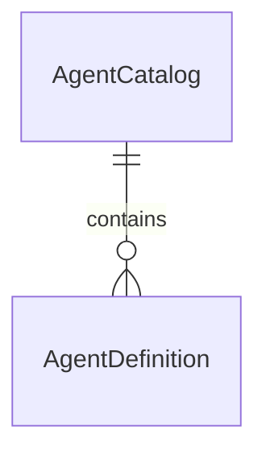

# Data Model: CLI Init Agent Selection

## AgentDefinition

Represents one supported AI coding agent as listed in the embedded catalog
(`internal/agentcatalog/agents.yaml`).

| Field          | Type   | Required | Notes                                                                 |
|----------------|--------|----------|------------------------------------------------------------------------|
| `id`           | string | yes      | Unique, stable identifier (e.g., `vscode`, `claude-code`, `cursor`)     |
| `display_name` | string | yes      | Human-readable name shown in the selection prompt (e.g., "Cursor")      |

**Validation rules** (FR-006, FR-007, FR-008, FR-009):

- `id` must be non-empty and unique within the catalog; entries with a
  duplicate `id` are de-duplicated (first occurrence wins) before the list is
  presented.
- `display_name` must be non-empty.
- The catalog is expected to gain additional fields per agent over future
  iterations (per user input); unknown/additional YAML fields must not break
  parsing of the fields defined today.

## AgentCatalog

The full set of `AgentDefinition` entries loaded from the embedded YAML file.

| Field    | Type                 | Notes                                              |
|----------|----------------------|-----------------------------------------------------|
| `agents` | []AgentDefinition    | Top-level YAML key; ordered as authored in the file |

**Validation rules**:

- The embedded file must parse as valid YAML matching this shape; a parse
  failure is treated as a malformed configuration (FR-007).
- An `agents` list that is empty (or absent) after parsing is treated as zero
  supported agents (FR-008).

## Relationships

