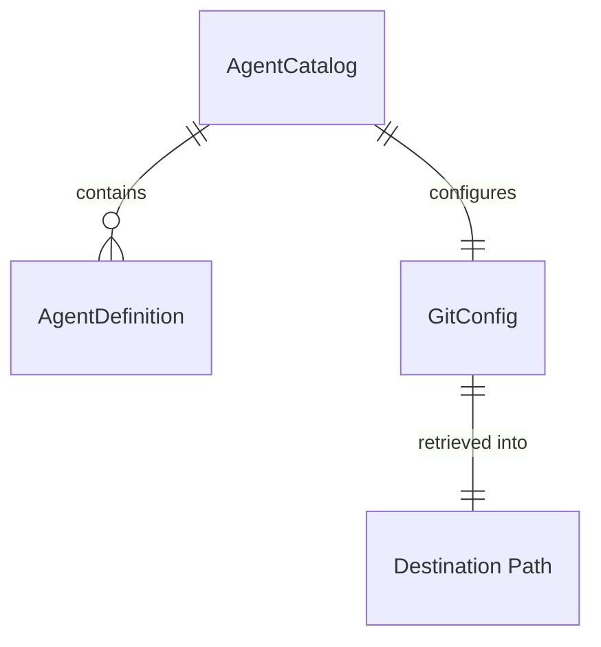

# Data Model: Agent Repository Clone

## GitConfig

Represents the single, tool-wide git repository and commit to retrieve after agent selection,
configured at the top level of `internal/agentcatalog/config.yaml` (independent of any specific
`AgentDefinition`).

| Field        | Type   | Required | Notes                                                                 |
|--------------|--------|----------|------------------------------------------------------------------------|
| `repository` | string | yes      | Git repository URL, assumed publicly accessible (e.g., `https://github.com/jacob623/ihighway-skills.git`) |
| `ref`        | string | yes      | Exact commit SHA to check out after cloning (not a branch or tag name) |

**Validation rules** (FR-006):

- Both `repository` and `ref` must be non-empty; a config missing either value is treated as "no
  git repository configured" and reported as a clear error before any retrieval is attempted.

## AgentCatalog (extended)

The existing `AgentCatalog` entity (from the `init` feature) gains one new field.

| Field    | Type              | Notes                                                        |
|----------|-------------------|----------------------------------------------------------------|
| `agents` | []AgentDefinition | Unchanged from the `init` feature                              |
| `git`    | GitConfig         | **NEW** top-level block; independent of any specific agent entry |

**Validation rules**:

- The renamed embedded file (`config.yaml`) must still parse as valid YAML matching this shape; a
  parse failure is treated as malformed configuration (unchanged from the `init` feature).
- `git` validation (see `GitConfig` above) is independent of `agents` validation; a catalog can be
  valid on the agents side while still failing the git-configuration check, and vice versa.

## Destination Path

The directory on the local machine where retrieved files are written.

| Source                      | Value                                                        |
|------------------------------|---------------------------------------------------------------|
| Positional `path` argument   | Explicit path supplied by the developer                       |
| Default                      | Current working directory (`os.Getwd()`) when the argument is omitted |

**Validation/behavior rules** (FR-003, FR-004, FR-009):

- Created if it does not already exist.
- Existing files at paths that collide with a retrieved file are overwritten.
- Existing files at non-colliding paths are left untouched.

## Relationships

