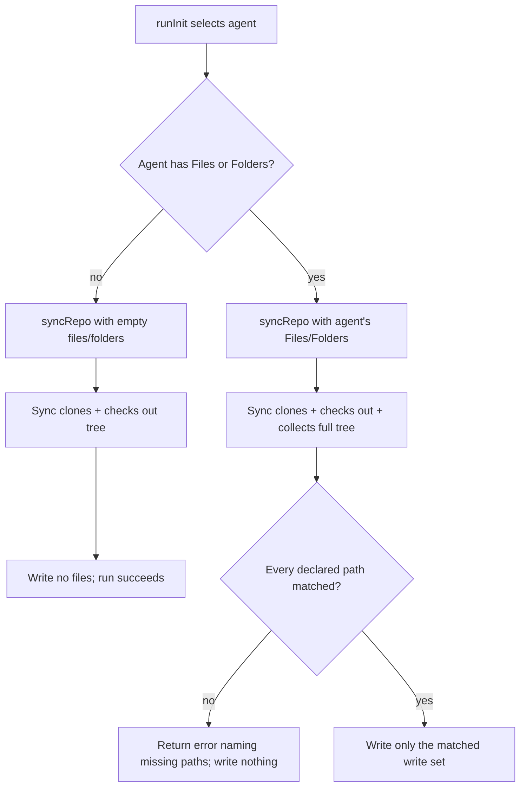

# Phase 1 Data Model: Selective File Retrieval

## AgentDefinition (extended)

Represents one supported AI coding agent listed in the catalog. Extends the struct introduced in
feature 001 (`ID`, `DisplayName`).

| Field         | Type       | YAML key   | Required | Notes                                                                                   |
|---------------|------------|------------|----------|------------------------------------------------------------------------------------------|
| `ID`          | `string`   | `id`       | yes      | Unchanged from feature 001.                                                              |
| `DisplayName` | `string`   | `display_name` | yes  | Unchanged from feature 001.                                                              |
| `Files`       | `[]string` | `files`    | no       | Declared individual file paths, relative to the repository root, forward-slash separated. |
| `Folders`     | `[]string` | `folders`  | no       | Declared folder paths, relative to the repository root, forward-slash separated.          |

**Validation rules** (enforced in `agentcatalog.LoadFS`, alongside existing `dedupeAndValidate`):

- Each entry in `Files` and `Folders` MUST NOT be empty, contain a `..` path segment, or be an
  absolute path. A violation returns `ErrInvalidDeclaredPath` (new sentinel error), naming the
  offending agent id and path, and load fails before any command logic runs (FR-006).
- Duplicate entries within `Files`, within `Folders`, or a `Files` entry that also falls under a
  `Folders` entry for the *same* agent, are not themselves a load-time error — deduplication is a
  `reposync` filtering-time concern, not a catalog-structure concern (FR-005).
- `Files`/`Folders` are independent of `dedupeAndValidate`'s existing id/display_name checks; an
  agent with an invalid declared path is rejected the same way a duplicate id or empty display
  name is rejected today — the whole catalog load fails, not just that agent.

## GitConfig (unchanged)

Tool-wide repository URL and pinned commit, unaffected by this feature — still a single shared
setting under `git:`, unrelated to which agent is selected.

## AgentCatalog (unchanged shape, richer contents)

`Agents []AgentDefinition` now carries richer entries; `Git GitConfig` is unchanged.

## reposync.Sync (extended contract)

**New signature**:

```go
func Sync(ctx context.Context, repository, ref, destination string, files, folders []string) error
```

| Parameter     | Meaning                                                                                          |
|---------------|---------------------------------------------------------------------------------------------------|
| `files`       | The selected agent's declared file paths (may be `nil`/empty).                                    |
| `folders`     | The selected agent's declared folder paths (may be `nil`/empty).                                  |

**Behavior**:

- When `files` and `folders` are both empty: write no files at all (FR-003) — the clone and
  checkout still happen (so an invalid repository/ref is still reported), but the write step is a
  no-op and the run still completes successfully.
- When either is non-empty: after collecting the full retrieved file tree, compute the write set
  as the union of (a) files whose repo-relative path exactly equals a `files` entry and (b) files
  whose repo-relative path has a `folders` entry as a path-prefix. Only that write set is written
  to `destination`; every other retrieved file is skipped (FR-002).
- Before writing anything, every declared entry in `files` and `folders` MUST match at least one
  path in the retrieved tree (exact match for `files`, prefix match for `folders`). If any entry
  matches nothing, `Sync` returns an error naming every unmatched path and writes no files
  (FR-004).
- Duplicate declared entries, or overlap between a `files` entry and a `folders` entry that both
  cover the same retrieved file, produce a single write of that file, no error (FR-005).
- The existing overwrite-only-on-collision semantics (feature 002, FR-009) apply unchanged to
  whatever write set is computed (FR-007).

## State / Control Flow


